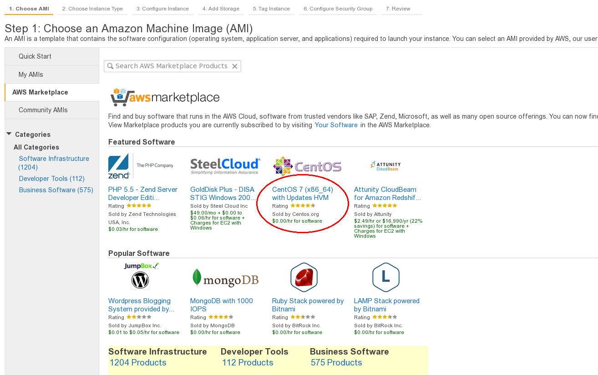

# gpu-desktop
Creating a working GPU accelerated Linux desktop in the cloud

## How to use this script
First spin up an amazon GPU instance. Use the latest Centos 7 AMI - ami-e4ff5c93

Wait for it to finish booting, then run the setup-desktop.sh script from this repo with the following arguements:

